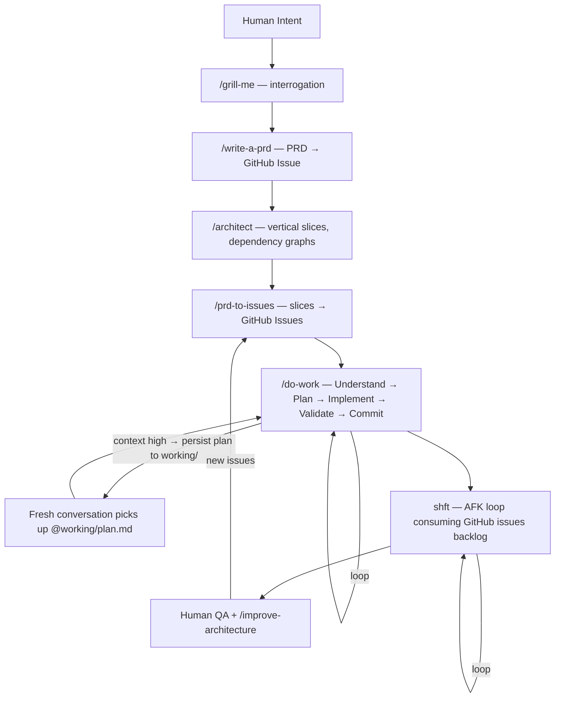

<p align="center">
  
</p>

# ctrl+shft

[](LICENSE)
[](https://github.com/arndvs/ctrlshft/actions/workflows/integrity.yml)

> Dotfiles for AI coding agents. One repo syncs instructions, skills, secrets, and autonomous loops across every machine.
>
> **ctrl** is the structure — instructions, skills, rules, secrets, context. **shft** is the autonomous loop — it picks issues, implements, commits, repeats.

Every developer using Claude Code or Copilot hits the same walls. Context degrades mid-task — the agent repeats itself, compaction loses nuance, quality drops. Instructions drift between your laptop and VPS. Secrets leak into agent context. Irrelevant rules load for every project regardless of stack.

ctrl+shft fixes all four. Clone it once, `bootstrap.sh` symlinks your instructions, skills, agents, and rules into `~/.claude/`, and `git pull` updates every machine. `detect-context.sh` loads only the rules that match your current stack. Secrets split into three tiers — config the agent can see, credentials that exist only inside a child process and vanish when it exits (`run-with-secrets.sh`), and AFK iteration tokens (short-lived GitHub App installation tokens) minted per loop. When context gets high, the agent persists its plan to `working/` so a fresh conversation continues exactly where the old one left off.

**Source of truth:** `~/dotfiles/` is canonical. `~/.claude/`, `~/.copilot/`, and `~/.agents/` are consumer targets populated from dotfiles (symlinked where possible, Windows fallback copy when needed). Make all edits in `~/dotfiles/` only.

```bash
# Fork at github.com/arndvs/ctrlshft/fork, then:
git clone https://github.com/YOUR_USERNAME/ctrlshft.git ~/dotfiles
bash ~/dotfiles/bin/bootstrap.sh   # or after install: ctrl bootstrap
```

Bootstrap is idempotent and cross-platform. It symlinks `~/.claude/CLAUDE.md`, `~/.claude/skills/`, `~/.claude/agents/`, and `~/.claude/rules/`, wires shell integration into `~/.bashrc`/`~/.zshrc`, creates `secrets/` from templates, installs Python dependencies from `skills/_local/requirements.txt` into `secrets/.venv` (including `PyJWT` for AFK GitHub App token minting), and adds supply chain protection to `~/.npmrc` and `uv.toml`. Full details in the [Installation](#installation) section.

---

## The pipeline

```
/grill-me       → Interrogate you about a feature until shared understanding
/write-a-prd    → Explore codebase, interview, write PRD, submit as GitHub issue
/architect      → Plan implementation — vertical slices, dependency graphs, acceptance criteria
/prd-to-issues  → Break the PRD into vertical slices → GitHub issues (AFK vs HITL labeled)
/do-work        → Understand → Plan → Implement → Validate → Commit (loops)
shft            → Pick issues from the backlog, implement in a Docker sandbox, commit, repeat
```



Use any skill individually or chain them. The planning pipeline (grill-me → write-a-prd → architect → prd-to-issues → do-work) hands off between stages.

---

## How it works

### One repo, every machine

Clone to `~/dotfiles` on your laptop, your VPS, anywhere. `git pull` updates both. That's it.

You edit `CLAUDE.base.md` (tracked in git). `bootstrap.sh` generates `CLAUDE.md` from it by appending `@`-references to any local instruction files in `instructions/_local/`. The generated file is symlinked to `~/.claude/` and read by Claude Code at runtime.

### Progressive context loading

`detect-context.sh` scans your working directory and exports `ACTIVE_CONTEXTS`. A Next.js project loads Next.js rules. A PHP project loads PHP rules. Nothing leaks between stacks.

```
VS Code opens a project
  ↓
CLAUDE.md → global.instructions.md (always loaded)
  ↓
detect-context.sh → ACTIVE_CONTEXTS=general,nextjs,node,typescript,sanity,prisma
  ↓
loads matching instructions/*.md
  ↓
rules/ scoped by paths: frontmatter — load only when matching files are touched
  ↓
agents/ available as subagent personas — isolated context, read-only tools
  ↓
skills/ auto-discovered — workflow + your personal _local/ skills
```

One setting enables the chain: `"chat.instructionsFilesLocations": {"~/dotfiles": true}` — included in `settings.json`, applied by `sync-settings.sh`.

### Private skills and instructions

`skills/_local/` and `instructions/_local/` are gitignored. Drop private or business-specific files there — auto-discovered alongside the public ones, never leave your machine.

```
skills/
├── do-work/                 ← public, tracked
├── systematic-debugging/    ← public, tracked
└── _local/                  ← GITIGNORED — yours alone
    └── your-skill/SKILL.md
```

### Subagent personas

`agents/` defines specialized subagents with their own system prompts, tool restrictions, and model preferences. Each runs in an isolated context window — exploration stays out of your main conversation.

Agents come in **model variants** — choose based on task complexity and cost sensitivity:

| Agent                | Model  | When to use                                           |
| -------------------- | ------ | ----------------------------------------------------- |
| `researcher`         | Sonnet | Default. General codebase exploration                 |
| `researcher-opus`    | Opus   | Complex cross-system analysis, architecture decisions |
| `researcher-haiku`   | Haiku  | Quick lookups, bulk scanning, simple patterns         |
| `code-reviewer`      | Sonnet | Default. Standard PR reviews, bug checks              |
| `code-reviewer-opus` | Opus   | Security-critical code, pre-deploy, complex changes   |
| `security-auditor`   | Sonnet | OWASP Top 10, secrets exposure, config hardening      |

All agents use read-only tools (Read, Grep, Glob, Bash) and `memory: user` for persistent cross-project learnings. Add your own: `agents/your-agent.md` — auto-discovered. See [agents/README.md](agents/README.md) for the full model selection guide.

> **Platform limitation:** Runtime model injection is not supported. Neither `search_subagent` nor `runSubagent` accepts a model parameter per-call. Model selection is static — set via `model:` frontmatter in agent files, or `chat.exploreAgent.defaultModel` for VS Code sub-agents. Create variant agent files to benchmark different models on the same task.

### Path-scoped rules

`rules/` contains convention-enforcement files that load only when the agent touches matching files. Each rule uses `paths:` YAML frontmatter to scope itself.

| Rule                          | Scoped to                                       |
| ----------------------------- | ----------------------------------------------- |
| `test-conventions`            | `**/*.test.*`, `**/*.spec.*`, `**/__tests__/**`, `**/*Service.{ts,tsx}`, `**/services/**/*.{ts,tsx}` |
| `migration-safety`            | `**/migrations/**`, `**/prisma/migrations/**`   |
| `env-security`                | `**/.env*`, `**/secrets/**`, `**/credentials*`  |
| `terminal-workarounds`        | Terminal sessions                               |
| `git-conventions`             | source files (`**/*.{ts,tsx,js,jsx,py,rb,go,...}`) |
| `typescript-conventions`      | `**/*.{ts,tsx}`                                 |
| `javascript-modern`           | `**/*.{ts,tsx,js,jsx,mjs,cjs}`                  |
| `frontend-conventions`        | `**/*.{ts,tsx,js,jsx,css,scss,html,svelte,vue}` |
| `dark-mode`                   | `**/*.{tsx,jsx,css,scss}`                       |
| `tailwind-shadcn`             | `**/*.{tsx,jsx}`                                |
| `framer-motion`               | `**/*.{tsx,jsx}`                                |
| `server-vs-client-components` | `**/app/**/*.{tsx,jsx}`                         |

Rules without `paths:` load every session. Add your own: `rules/your-rule.md` — auto-discovered.

### Four-tier disclosure model

Instructions are organized so the always-on payload stays small and conditional knowledge only loads when needed:

| Tier | Loaded when | Where |
| ---- | ----------- | ----- |
| **T1 always-on** | every session | `global.instructions.md`, `instructions/handoff.instructions.md` |
| **T2 context-gated** | `ACTIVE_CONTEXTS` matches | `instructions/{nextjs,sanity,php,...}.instructions.md` |
| **T2 service/task-triggered** | task or service mentioned | `instructions/{css,sentry,google-docs,hud,...}.instructions.md` |
| **T3 path-gated** | edited file matches `paths:` glob | `rules/*.md` |
| **T4 skill-triggered** | task description matches | `skills/*/SKILL.md` |

Re-shelve aggressively: if a rule applies only to `.tsx` files, it belongs in `rules/`, not `global.instructions.md`.

### Hardened secrets

Three tiers. Agents see config, never credentials — and AFK loops use AFK iteration tokens instead of long-lived auth tokens.

| File                   | In shell? | Agent-visible? | Contains                     |
| ---------------------- | --------- | -------------- | ---------------------------- |
| `secrets/.env.agent`   | Yes       | Yes            | Usernames, hosts, IDs        |
| `secrets/.env.secrets` | No        | No             | API keys, tokens, passwords  |
| AFK iteration token    | No        | No             | Minted per loop, expires ~1h |

`run-with-secrets.sh` injects credentials into a child process only — they vanish when it exits. Claude Code deny rules block `env`, `printenv`, `cat secrets/*`, and `echo $*KEY*` at the agent level. Agents can't accidentally inherit what they can't see.

### AFK Docker credential rotation (strong defense)

For AFK runs, credentials should rotate between Docker iterations:

- Mint an AFK iteration token (short-lived GitHub App installation token) for each loop
- Inject the token only for that iteration's process
- Expire naturally (and fail closed on mint failure)
- Do not allow PAT fallback in AFK mode

This closes the most common leakage path: one long-lived credential reused across many autonomous runs.

### Exact secure setup after clone

After clone + bootstrap, this is the exact secure AFK setup path:

1. Create a GitHub App at `https://github.com/settings/apps/new`.
   - Name: e.g. `ctrl-shft-bot`
   - Homepage URL: your own GitHub dotfiles repository URL (e.g. `https://github.com/<you>/dotfiles`)
   - Webhook: disable for now (not required for this flow)
   - Repository permissions (minimum):
     - Contents: Read & Write
     - Issues: Read & Write
     - Pull requests: Read & Write
     - Workflows: Read & Write (only if AFK needs to edit `.github/workflows/*`)
   - Installation target: only your account/org that owns the repo
2. In the App settings page, click **Generate a private key** and download the `.pem` file.
3. Install the App on the repo/fork AFK will work on:
   - Open your app page (e.g. `https://github.com/settings/apps/ctrl-shft-bot`)
   - Click **Install App**
   - Choose account/org, then **Only select repositories**, then target repo, then **Install**
4. Capture your installation ID from the redirect URL after install:
   - URL format: `https://github.com/settings/installations/<id>`
   - The numeric trailing segment is `GITHUB_APP_INSTALLATION_ID`
5. Base64 encode the private key to one line:
   - Linux / Git Bash: `base64 -w 0 ~/Downloads/your-app-key.pem`
   - macOS: `base64 < ~/Downloads/your-app-key.pem | tr -d '\n'`
   - PowerShell: `[Convert]::ToBase64String([IO.File]::ReadAllBytes("$HOME\\Downloads\\your-app-key.pem"))`
6. Fill `~/dotfiles/secrets/.env.secrets` with:
   - `GITHUB_APP_ID`
   - `GITHUB_APP_INSTALLATION_ID`
   - `GITHUB_APP_PRIVATE_KEY_B64`
7. Run `ctrl check --afk` and fix any hard-fail messages.
8. Run token-safe mint verification (prints status/expiry/length, not the raw token):

   ```bash
   ctrl verify-token
   ```

   Expected shape:

   ```text
   ================================================================
   GitHub App Token Smoke Test (safe output)
   ================================================================
     ✓ mint_success=yes
       expires_at=2026-04-14T23:58:47Z
       token_len=40
   ================================================================
   ```

9. Start AFK with one iteration (`shft afk 1`), then scale iterations once stable.

> **Windows note (important):** On some Windows setups, `python3` resolves to a Microsoft Store alias and fails. AFK scripts now prefer `secrets/.venv` Python automatically. If you hit Python launch/dependency errors, rerun `bash ~/dotfiles/bin/bootstrap.sh` to rebuild the venv and retry.

If PAT variables are present in AFK mode, treat that as a hard configuration error and remediate before running.

If `mint_github_app_token.py` reports missing `PyJWT` or `requests`, re-run `ctrl bootstrap` (or `bash ~/dotfiles/bin/bootstrap.sh`) to refresh `secrets/.venv` packages.

If a raw token is ever printed to terminal/chat/logs, treat that as an exposure event and rotate immediately:

1. Open `https://github.com/settings/apps/ctrl-shft-bot`
2. Regenerate (or delete + generate) a new private key
3. Download new `.pem`
4. Re-encode: `base64 -w 0 ~/Downloads/your-new-key.pem`
5. Update `GITHUB_APP_PRIVATE_KEY_B64` in `secrets/.env.secrets`
6. Re-run the token-safe mint verification command above

---

## Skills

Every skill's `description` is loaded into the agent's system prompt at session start. The agent reads a skill's full `SKILL.md` when it detects a matching situation. Skills marked ⚡ have broad descriptions that match common task patterns — the agent loads them automatically without you asking. The rest have narrow descriptions and fire only when you invoke them by name or via `/slash-command`.

The benefit: ⚡ skills act as passive guardrails. You don't remember to say "use the debugging skill" — the agent recognizes an error and loads the root-cause-first investigation protocol on its own. Same rigorous process every time, without you thinking about it.

| Skill                     | What it does                                                                                            |
| ------------------------- | ------------------------------------------------------------------------------------------------------- |
| `do-work`                 | Detect your stack's feedback loops. Understand → Plan → Implement → Validate → Commit.                  |
| `grill-me`                | Interrogate you about a plan until shared understanding. One question at a time, recommended answers.   |
| `write-a-prd`             | Explore codebase, interview you, sketch module boundaries, write PRD, submit as GitHub issue.           |
| `prd-to-issues`           | Break a PRD into vertical slices. Label each AFK or HITL. Create GitHub issues with dependencies.       |
| `architect` ⚡            | Plan implementation — vertical slices, dependency graphs, acceptance criteria.                          |
| `skill-scaffolder`        | Scaffold new agent skills from production-tested patterns. Interview → architecture → directory.        |
| `explore` ⚡              | Decompose a topic, spawn parallel sub-agents, synthesize a summary.                                     |
| `research` ⚡             | Cache expensive exploration into `research.md`. Staleness checks, lifecycle management.                 |
| `codebase-audit` ⚡       | Ruthless code audit — real problems only, grouped by severity. No manufactured issues.                  |
| `improve-architecture` ⚡ | Find shallow-module clusters, spawn parallel design agents, file a GitHub RFC.                          |
| `tdd`                     | Red-green refactor. Failing test → implement → refactor. Backend only.                                  |
| `systematic-debugging` ⚡ | Root-cause-first — investigate → pattern analysis → hypothesis → fix.                                   |
| `atomic-commits` ⚡       | Branch-isolated atomic commits. Survey diff, group by seam, commit or ship (push + PR).                 |
| `code-review`             | Focused review of staged or recent changes. Edge cases, logic errors, integration risks.                |
| `document`                | Write, update, or audit documentation. Accurate, minimal, audience-appropriate.                         |
| `compliance-audit` ⚡     | Auto-invoked after do-work/tdd/debugging. Rule-by-rule review, violation flagging, skill gap detection. |
| `stress-test`             | Adversarial 19-scenario protocol across 6 categories. Validates rule compliance boundaries.             |
| `sanity-best-practices`   | Sanity schema design, GROQ, TypeGen, Visual Editing, Portable Text, framework integrations.             |

Add your own: `skills/_local/your-skill/SKILL.md` — auto-discovered, gitignored.

---

## Slash Commands

Thin launchers in `commands/` that load a skill with your arguments. Type the command in chat — the agent loads the full skill protocol automatically.

| Command     | Loads skill      | What it does                                                         |
| ----------- | ---------------- | -------------------------------------------------------------------- |
| `/work`     | `do-work`        | Core execution loop — understand, plan, implement, validate, commit. |
| `/plan`     | `architect`      | Vertical slices, dependency graphs, acceptance criteria.             |
| `/audit`    | `codebase-audit` | Ruthless audit — real problems only, grouped by severity.            |
| `/review`   | `code-review`    | Focused review of staged or recent changes.                          |
| `/explore`  | `explore`        | Decompose a topic, spawn parallel sub-agents, synthesize.            |
| `/test`     | `tdd`            | Red-green refactor. Failing test → implement → refactor.             |
| `/document` | `document`       | Write, update, or audit documentation.                               |

Add your own: `commands/your-command.md` — auto-discovered. Each file is a prompt template with `$ARGUMENTS` passthrough.

---

## Coding principles

Four behavioral principles baked into `global.instructions.md`, derived from [Andrej Karpathy's observations](https://x.com/karpathy/status/2015883857489522876) on LLM coding pitfalls. These address the most expensive failure modes: building the wrong thing, overengineering, drive-by refactoring, and vague success criteria.

### 1. Think Before Coding

> Don't assume. Don't hide confusion. Surface tradeoffs.

LLMs silently pick an interpretation and run with it. These rules force explicit reasoning:

- **Stop when confused** — Name what's unclear and ask. Never pick an interpretation silently
- **Present multiple interpretations** — If ambiguity exists, list options and ask which one before implementing
- **Push back when simpler exists** — If a simpler approach works, say so — even if the user asked for the complex version
- **State assumptions explicitly** — If uncertain, ask follow-up questions. Think "What's wrong with this plan?"

### 2. Simplicity First

> Minimum code that solves the problem. Nothing speculative.

Combat the tendency toward overengineering:

- No features beyond what was asked
- No abstractions for single-use code
- No "flexibility" or "configurability" that wasn't requested
- No error handling for impossible scenarios
- If 200 lines could be 50, rewrite it

**The test:** Would a senior engineer say this is overcomplicated? If yes, simplify.

### 3. Surgical Changes

> Touch only what you must. Clean up only your own mess.

When editing existing code:

- **Match existing style exactly** — even if you'd write it differently. No formatting, naming, or structural changes outside the task
- **Don't refactor what isn't broken** — if you notice unrelated problems, mention them — don't fix them
- **Mention unrelated dead code, don't delete it** — only remove imports/variables/functions that YOUR changes made unused
- **Don't "improve" adjacent code**, comments, or formatting

**The test:** Every changed line should trace directly to the user's request.

### 4. Goal-Driven Execution

> Define success criteria. Loop until verified.

Transform imperative tasks into verifiable goals:

| Instead of...    | Transform to...                                       |
| ---------------- | ----------------------------------------------------- |
| "Add validation" | "Write tests for invalid inputs, then make them pass" |
| "Fix the bug"    | "Write a test that reproduces it, then make it pass"  |
| "Refactor X"     | "Ensure tests pass before and after"                  |

For multi-step tasks, state a brief plan with verification at each step. Strong success criteria let the agent loop independently. Weak criteria ("make it work") require constant clarification.

ctrl extends this with dedicated skills: `tdd` (red-green-refactor), `systematic-debugging` (root-cause-first investigation), and `do-work` (auto-detects feedback loops and validates before committing).

### How to know it's working

These principles are working if you see:

- **Fewer unnecessary changes in diffs** — only requested changes appear
- **Fewer rewrites due to overcomplication** — code is simple the first time
- **Clarifying questions come before implementation** — not after mistakes
- **Clean, minimal commits** — no drive-by refactoring or "improvements"

> **Tradeoff:** These principles bias toward caution over speed. For trivial tasks (typo fixes, obvious one-liners), the agent uses judgment — not every change needs the full rigor.

---

## Hooks

Claude Code lifecycle hooks — shell scripts that fire on tool use and session events. Bootstrap symlinks `hooks/` → `~/.claude/hooks/` and merges configuration from `settings-hooks.json` into `~/.claude/settings.json`.

| Hook                  | Event            | What it does                                                                                   |
| --------------------- | ---------------- | ---------------------------------------------------------------------------------------------- |
| `secret-guard.sh`     | PreToolUse       | Blocks commands that expose credentials (`echo $TOKEN`, bare `env`/`printenv`, `cat secrets/`) |
| `migration-guard.sh`  | PreToolUse       | Blocks database migration commands targeting non-test databases                                |
| `compaction-guard.sh` | PreCompact       | Blocks auto-compaction at ~95% context; directs agent to follow handoff protocol               |
| `format-check.sh`     | Stop             | Detects Biome/Prettier/ESLint and formats modified files (non-blocking)                        |
| `typecheck.sh`        | Stop             | Runs `tsc --noEmit` on TypeScript projects; blocks stop until types pass                       |
| `context-warning.sh`  | UserPromptSubmit | Stub: graduated warnings at 40/70% context (pending statusLine experiment)                     |

Hooks communicate via exit codes: **0** = allow, **2** = block. See `hooks/README.md` for full documentation, customization, and the `experiments/` directory for in-progress prototypes.

---

## shft: autonomous agent loop

> `ctrl` is the structure — instructions, skills, rules, secrets, context. `shft` is the autonomous loop — it picks issues, implements, commits, repeats. **ctrl+shft** — you define the rules, shft executes them.

shft is not a framework. It's a bash loop that runs Claude against your GitHub issues backlog — sandboxed in Docker for Away From Keyboard (AFK) mode, direct on host for Human In The Loop (HITL).

### Two modes

| Mode | Script         | Use when                                                      |
| ---- | -------------- | ------------------------------------------------------------- |
| HITL | `shft/once.sh` | Learning — runs once while you watch                          |
| AFK  | `shft/afk.sh`  | Shipping — loops in Docker sandbox with a max iteration guard |

AFK mode: Claude picks a task, implements it, commits, closes the issue, picks the next one. Exits when the backlog is empty (`<promise>NO MORE TASKS</promise>`). You review PRs async.

### Task priority order

1. Critical bugfixes — blockers first
2. Dev infrastructure — tests, types, scripts before features
3. Tracer bullets — small end-to-end slices that validate approach
4. Polish and quick wins
5. Refactors

### Docker sandboxing

`--dangerously-skip-permissions` needs a cage. Docker isolates Claude in a micro-VM. It can run commands, write files, use git — but it can't reach your host filesystem.

```bash
# srt (Anthropic Sandbox Runtime) manages Docker containers
srt claude .
```

### Activation checklist

- [ ] Claude Max subscription
- [ ] Docker Desktop installed
- [ ] `jq` installed
- [ ] `srt` (Anthropic Sandbox Runtime) installed
- [ ] `shft/once.sh`, `shft/afk.sh`, `shft/prompt.md` in place
- [ ] GitHub App credentials configured in `secrets/.env.secrets` (`GITHUB_APP_ID`, `GITHUB_APP_INSTALLATION_ID`, `GITHUB_APP_PRIVATE_KEY_B64`)
- [ ] Deny rules validated in sandbox
- [ ] 5–10 well-formed GitHub issues ready
- [ ] Start HITL → graduate to AFK (1 iteration) → scale up

---

## CLI — `ctrl` & `shft`

After bootstrap, two commands are available system-wide. `ctrl` manages your environment, `shft` manages your work queue. Both are symlinked to `~/.local/bin/` by bootstrap.

```bash
ctrl help     # infrastructure commands
shft help     # autonomous execution commands
```

### ctrl — infrastructure management

| Command                 | What it does                                             |
| ----------------------- | -------------------------------------------------------- |
| `ctrl check`            | Validate symlinks + environment                          |
| `ctrl check --afk`      | AFK mode validation (jq, srt, GitHub App creds)          |
| `ctrl bootstrap [opts]` | Run bootstrap (`--adopt`, `--minimal`)                   |
| `ctrl sync`             | `git pull` + bootstrap + reload shell                    |
| `ctrl sync-settings`    | Merge managed VS Code settings (`--dry-run`, `--stable`) |
| `ctrl status`           | Show contexts, client, symlinks, HUD status              |
| `ctrl context`          | Detect and display active contexts                       |

#### ctrl hud

| Command               | What it does                           |
| --------------------- | -------------------------------------- |
| `ctrl hud`            | Start the compliance HUD               |
| `ctrl hud stop`       | Stop the HUD daemon                    |
| `ctrl hud status`     | Check if running                       |
| `ctrl hud restart`    | Stop + start                           |
| `ctrl hud logs [-f]`  | Show daemon log (add `-f` to follow)   |
| `ctrl hud events`     | Show recent events for current project |
| `ctrl hud violations` | Show violations for current project    |
| `ctrl hud state`      | Full debug state dump (JSON)           |
| `ctrl hud clear`      | Clear events for a project             |
| `ctrl hud open`       | Open HUD in browser                    |
| `ctrl hud url`        | Print the HUD URL                      |
| `ctrl hud --fg`       | Run HUD in foreground (debug mode)     |

#### ctrl client management & credentials

| Command             | What it does                                             |
| ------------------- | -------------------------------------------------------- |
| `ctrl new-client`   | Onboard a new client                                     |
| `ctrl migrate`      | Read-only diagnostic for existing setups                 |
| `ctrl uninstall`    | Safely remove all ctrl+shft symlinks + shell integration |
| `ctrl verify-token` | Test-mint a GitHub App token                             |

#### ctrl session analysis (requires [sheal](https://github.com/liwala/sheal))

| Command               | What it does                                            |
| --------------------- | ------------------------------------------------------- |
| `ctrl retro`          | Session retrospective → extract learnings into dotfiles |
| `ctrl digest`         | Categorized prompt digest                               |
| `ctrl cost`           | Token cost dashboard                                    |
| `ctrl ask "question"` | Search across session transcripts                       |
| `ctrl learn`          | Manage session learnings                                |
| `ctrl version`        | Show version                                            |
| `ctrl help`           | Show all commands                                       |

### shft — autonomous execution

| Command           | What it does                                    |
| ----------------- | ----------------------------------------------- |
| `shft run`        | HITL — run once while you watch                 |
| `shft afk [n]`    | AFK — autonomous loop (default 5 iterations)    |
| `shft status`     | Is a loop running? How many issues open?        |
| `shft stop`       | Stop a running AFK loop after current iteration |
| `shft log [-f]`   | Show shft log (add `-f` to follow)              |
| `shft issues`     | List open issues in priority order              |
| `shft next`       | Show the single next issue shft would pick      |
| `shft done [n]`   | Show last n closed issues (default 10)          |
| `shft context`    | Show what the agent will see when it starts     |
| `shft plan`       | View `working/plan.md`                          |
| `shft plan edit`  | Open plan in `$EDITOR`                          |
| `shft plan clear` | Clear the plan file                             |
| `shft validate`   | Run AFK pre-flight checks                       |
| `shft mint`       | Test-mint a GitHub App token                    |
| `shft prompt`     | Show `shft/prompt.md`                           |
| `shft version`    | Show version                                    |
| `shft help`       | Show all commands                               |

---

## What's in the box

```
~/dotfiles/
├── CLAUDE.base.md                   ← edit this — bootstrap generates CLAUDE.md from it
├── CLAUDE.md                        ← GENERATED (gitignored)
├── CHANGELOG.md                     ← release history
├── CONTRIBUTING.md                  ← contribution guide
├── global.instructions.md           ← universal rules, always loaded
├── package.json                     ← optional deps (better-sqlite3 for HUD persistence)
├── settings.json                    ← managed VS Code settings
├── .env.agent.example               ← template for non-sensitive config
├── .env.citation.example            ← template for citation skill config
├── .env.secrets.example             ← template for API keys and tokens
├── .gitattributes                   ← LF line ending enforcement
├── instructions/
│   ├── nextjs.instructions.md
│   ├── php.instructions.md
│   ├── sanity.instructions.md
│   ├── sentry.instructions.md
│   ├── google-docs.instructions.md
│   ├── css.instructions.md
│   ├── handoff.instructions.md      ← cross-conversation persistence protocol
│   └── _local/                      ← GITIGNORED — your private instructions
├── commands/
│   ├── audit.md                     /audit → codebase-audit skill
│   ├── document.md                  /document → document skill
│   ├── explore.md                   /explore → explore skill
│   ├── plan.md                      /plan → architect skill
│   ├── review.md                    /review → code-review skill
│   ├── test.md                      /test → tdd skill
│   └── work.md                      /work → do-work skill
├── agents/
│   ├── README.md                    model selection guide + agent docs
│   ├── code-reviewer.md             subagent: bugs, correctness, security (sonnet)
│   ├── code-reviewer-opus.md        subagent: high-stakes reviews (opus)
│   ├── researcher.md                subagent: deep codebase exploration (sonnet)
│   ├── researcher-opus.md           subagent: complex architecture analysis (opus)
│   ├── researcher-haiku.md          subagent: fast bulk scanning (haiku)
│   └── security-auditor.md          subagent: OWASP, secrets, config (sonnet)
├── rules/
│   ├── test-conventions.md          scoped to tests and service code
│   ├── migration-safety.md          scoped to **/migrations/**
│   ├── env-security.md              scoped to **/.env*, **/secrets/**
│   └── terminal-workarounds.md      scoped to terminal sessions
├── hooks/
│   ├── README.md                    hook documentation
│   ├── settings-hooks.json          hook configuration for Claude Code
│   ├── compaction-guard.sh          blocks auto-compaction, enforces handoff
│   ├── context-warning.sh           graduated warnings at 40/70% context
│   ├── format-check.sh             auto-formats modified files on stop
│   ├── migration-guard.sh           blocks unsafe migration commands
│   ├── secret-guard.sh              blocks credential exposure in agent output
│   ├── typecheck.sh                 runs tsc --noEmit before stop
│   └── experiments/                 experimental hook prototypes
├── skills/
│   ├── do-work/
│   ├── grill-me/
│   ├── write-a-prd/
│   ├── prd-to-issues/
│   ├── architect/
│   ├── skill-scaffolder/
│   ├── explore/
│   ├── research/
│   ├── codebase-audit/
│   ├── improve-architecture/
│   ├── tdd/
│   ├── systematic-debugging/
│   ├── atomic-commits/
│   ├── code-review/
│   ├── document/
│   ├── compliance-audit/
│   ├── stress-test/
│   ├── sanity-best-practices/
│   └── _local/                      ← GITIGNORED — your private skills
├── clients/
│   ├── README.md                    per-client instruction isolation guide
│   └── _template/                   scaffolding for new client projects
├── shft/
│   ├── shft                         CLI entry point — autonomous execution
│   ├── afk.sh                       AFK autonomous loop
│   ├── once.sh                      HITL single-run
│   ├── _build_prompt.sh             prompt assembly for shft runs
│   └── prompt.md                    shared agent prompt
├── bin/
│   ├── ctrl                         CLI entry point — infrastructure management
│   ├── _lib.sh                      shared shell library
│   ├── _adopt.sh                    bootstrap --adopt migration helper
│   ├── bootstrap.sh                 one-command setup, idempotent
│   ├── agent-shell.sh               secrets-free shell for agent sessions
│   ├── sync-settings.sh             deep-merge VS Code settings
│   ├── load-secrets.sh              sources .env.agent into shell
│   ├── run-with-secrets.sh          process-scoped secret injection
│   ├── detect-context.sh            exports ACTIVE_CONTEXTS
│   ├── detect-client.sh             per-client context detection
│   ├── new-client.sh                scaffold new client instruction set
│   ├── migrate.sh                   safe migration from manual setup
│   ├── uninstall.sh                 clean removal of all symlinks + shell integration
│   ├── validate-env.sh              env + hardening validation
│   ├── validate-symlinks.sh         verify bootstrap symlinks
│   ├── mint_github_app_token.py     AFK token minting
│   ├── verify-github-app-token.sh   safe token verification
│   ├── hud-daemon.js          HUD HTTP server
│   ├── start-hud.sh           daemon lifecycle (start/stop/status/restart)
│   └── write-hud-state.sh     non-blocking compliance event emitter
├── hud/                       ← HUD UI
│   ├── README.md                    HUD architecture + API reference
│   └── index.html
├── site/                            ← landing page (ctrlshft.dev)
│   ├── index.html
│   ├── CNAME
│   └── assets/
├── docs/
│   ├── adr/                         architecture decision records
│   ├── observability-benchmarking-plan.md
│   └── readme-site-deep-audit.md
├── working/                         ← GITIGNORED — cross-conversation plans
└── secrets/                         ← GITIGNORED
    ├── .env.agent
    ├── .env.secrets
    └── .venv/
```

<details>
<summary>Context detection signals</summary>

`detect-context.sh` scans the current directory for these file signatures:

| Signal       | File                                                          | Context        |
| ------------ | ------------------------------------------------------------- | -------------- |
| Next.js      | `next.config.{ts,js,mjs}`                                     | `nextjs`       |
| React Native | `"react-native"` in `package.json`                            | `react-native` |
| React        | `"react"` in `package.json` (if not Next/Native)              | `react`        |
| Node         | `package.json`                                                | `node`         |
| TypeScript   | `tsconfig.json`                                               | `typescript`   |
| PHP          | `composer.json`                                               | `php`          |
| Sanity       | `sanity.config.*`, `sanity.cli.*`                             | `sanity`       |
| Prisma       | `prisma/schema.prisma`                                        | `prisma`       |
| Docker       | `Dockerfile`, `docker-compose.yml/.yaml`, `compose.yml/.yaml` | `docker`       |
| Python       | `requirements.txt`, `pyproject.toml`, `setup.py`, `Pipfile`   | `python`       |
| Laravel      | `artisan`                                                     | `laravel`      |

</details>

<details>
<summary>Key VS Code settings</summary>

| Setting                                               | Value                                                | Why                                       |
| ----------------------------------------------------- | ---------------------------------------------------- | ----------------------------------------- |
| `chat.instructionsFilesLocations`                     | `{"~/dotfiles": true, ".github/instructions": true}` | Enables instruction/skill discovery chain |
| `chat.agent.maxRequests`                              | `100000`                                             | Prevents agent from stopping mid-task     |
| `github.copilot.chat.anthropic.thinking.budgetTokens` | `32000`                                              | Extended thinking for complex reasoning   |
| `chat.exploreAgent.defaultModel`                      | `Claude Opus 4.6 (copilot)`                          | Model selection for explore subagent      |

</details>

---

## Installation

> **Before you install:** Bootstrap is mostly idempotent but touches several dotfiles:
>
> - **`~/.claude/CLAUDE.md`** — replaced with a symlink (or overwritten on Windows). Back up if you have a custom one.
> - **`~/.claude/skills/`** — symlinked if absent or a stale link. Existing real directories are left alone (manual merge message shown).
> - **`~/.claude/agents/`** — symlinked if absent or a stale link. Same behavior as skills/.
> - **`~/.claude/rules/`** — symlinked if absent or a stale link. Same behavior as skills/.
> - **`~/.claude/commands/`** — symlinked if absent or a stale link. Slash command wrappers.
> - **`~/.claude/hooks/`** — symlinked if absent or a stale link. Lifecycle hook scripts.
> - **`~/.claude/settings.json`** — hook configuration merged (requires jq). Existing settings preserved.
> - **`~/.bashrc` / `~/.zshrc`** — appends shell integration (load-secrets + context detection). Idempotent on re-runs.
> - **`~/.npmrc`** — appends `min-release-age=7` for supply chain protection.
> - **`~/.config/uv/uv.toml`** — adds `exclude-newer` date for supply chain protection.
>
> **Not run by bootstrap:** `sync-settings.sh` (VS Code settings merge) is a separate manual step. Run with `--dry-run` first to preview changes.

<details>
<summary>Quick setup (recommended)</summary>

```bash
# Fork at github.com/arndvs/ctrlshft/fork, then:
git clone https://github.com/YOUR_USERNAME/ctrlshft.git ~/dotfiles
bash ~/dotfiles/bin/bootstrap.sh
```

Bootstrap is idempotent — safe to re-run. It handles:

- Generating `CLAUDE.md` from `CLAUDE.base.md` + your local instruction files
- Creating `secrets/.env.agent` and `secrets/.env.secrets` from templates
- Symlinking `~/.claude/CLAUDE.md`, `~/.claude/skills/`, `~/.claude/agents/`, `~/.claude/rules/`, `~/.claude/commands/`, and `~/.claude/hooks/`
- Merging hook configuration into `~/.claude/settings.json`
- Creating `skills/_local/` and `instructions/_local/`
- Wiring `load-secrets.sh` and `detect-context.sh` into `~/.bashrc`
- Creating the Python venv
- Installing Python packages from `skills/_local/requirements.txt` into `secrets/.venv` (includes `PyJWT` for AFK token minting)

After bootstrap:

```bash
$EDITOR ~/dotfiles/secrets/.env.agent       # non-sensitive config
$EDITOR ~/dotfiles/secrets/.env.secrets     # API keys and tokens
source ~/.bashrc                            # adds ctrl/shft to PATH
ctrl sync-settings                          # merge VS Code settings
```

> **Windows:** file symlinks require admin. Bootstrap falls back to copying `CLAUDE.md` and prints upgrade instructions. Directory symlinks work via Developer Mode.

</details>

<details>
<summary>VPS setup</summary>

Same as local — skip `sync-settings.sh` (VS Code Remote SSH forwards your settings).

```bash
# Fork at github.com/arndvs/ctrlshft/fork, then:
git clone https://github.com/YOUR_USERNAME/ctrlshft.git ~/dotfiles
bash ~/dotfiles/bin/bootstrap.sh
$EDITOR ~/dotfiles/secrets/.env.agent
$EDITOR ~/dotfiles/secrets/.env.secrets
source ~/.bashrc
```

</details>

<details>
<summary>Manual setup</summary>

```bash
# 1. Fork at github.com/arndvs/ctrlshft/fork, then clone
git clone https://github.com/YOUR_USERNAME/ctrlshft.git ~/dotfiles

# 2. Generate CLAUDE.md and symlink
bash ~/dotfiles/bin/bootstrap.sh   # or manually:
mkdir -p ~/.claude
ln -sf ~/dotfiles/CLAUDE.md ~/.claude/CLAUDE.md
ln -sf ~/dotfiles/skills ~/.claude/skills
ln -sf ~/dotfiles/agents ~/.claude/agents
ln -sf ~/dotfiles/rules ~/.claude/rules
ln -sf ~/dotfiles/commands ~/.claude/commands
ln -sf ~/dotfiles/hooks ~/.claude/hooks

# 3. Secrets
cp ~/dotfiles/.env.agent.example ~/dotfiles/secrets/.env.agent
cp ~/dotfiles/.env.secrets.example ~/dotfiles/secrets/.env.secrets

# 4. Shell integration — add to ~/.bashrc
[[ -f ~/dotfiles/bin/load-secrets.sh ]] && source ~/dotfiles/bin/load-secrets.sh
_load_context() { [[ -f ~/dotfiles/bin/detect-context.sh ]] && source ~/dotfiles/bin/detect-context.sh > /dev/null 2>&1; }
cd() { builtin cd "$@" && _load_context; }
_load_context

# 5. VS Code settings
ctrl sync-settings
```

</details>

<details>
<summary>What bootstrap touches</summary>

> Bootstrap is mostly idempotent. Here's everything it modifies:

| File                       | Change                                                                              |
| -------------------------- | ----------------------------------------------------------------------------------- |
| `~/.claude/CLAUDE.md`      | Symlinked → `~/dotfiles/CLAUDE.md` (or copied on Windows without admin)             |
| `~/.claude/skills/`        | Linked to `~/dotfiles/skills/` (or replaced with verified fallback copy on Windows) |
| `~/.claude/agents/`        | Linked to `~/dotfiles/agents/` (or replaced with verified fallback copy on Windows) |
| `~/.claude/rules/`         | Linked to `~/dotfiles/rules/` (or replaced with verified fallback copy on Windows)  |
| `~/.copilot/skills/`       | Linked to `~/dotfiles/skills/` (or replaced with verified fallback copy on Windows) |
| `~/.agents/skills/`        | Linked to `~/dotfiles/skills/` (or replaced with verified fallback copy on Windows) |
| `~/.bashrc` / `~/.zshrc`   | Appends `load-secrets.sh` + `detect-context.sh` integration (idempotent)            |
| `~/.npmrc`                 | Appends `min-release-age=7` (supply chain protection)                               |
| `~/.config/uv/uv.toml`     | Adds `exclude-newer` date (supply chain protection)                                 |
| `secrets/.env.agent`       | Created from `.env.agent.example` if missing                                        |
| `secrets/.env.secrets`     | Created from `.env.secrets.example` if missing                                      |
| `secrets/.venv/`           | Python venv created for local skill packages                                        |
| `~/.claude/commands/`      | Linked to `~/dotfiles/commands/`                                                    |
| `~/.claude/hooks/`         | Linked to `~/dotfiles/hooks/`                                                       |
| `~/.claude/settings.json`  | Hook config merged into existing settings                                           |
| `~/.local/bin/ctrl`        | CLI installed (symlink or copy)                                                     |
| `~/.local/bin/shft`        | CLI installed (symlink or copy)                                                     |
| `working/active-client.md` | Created from template if missing                                                    |

**Not run by bootstrap:** `sync-settings.sh` (VS Code settings merge) is manual. Run with `--dry-run` first.

</details>

---

## Customization

| Want to...                | Do this                                                                                                                                     |
| ------------------------- | ------------------------------------------------------------------------------------------------------------------------------------------- |
| Add a new stack           | Create `instructions/yourstack.instructions.md`, add detection to `detect-context.sh`, reference in `CLAUDE.base.md`, re-run `bootstrap.sh` |
| Add a public skill        | Create `skills/your-skill/SKILL.md` — auto-discovered                                                                                       |
| Add a private skill       | Create `skills/_local/your-skill/SKILL.md` — auto-discovered, gitignored                                                                    |
| Add a private instruction | Create `instructions/_local/your-topic.instructions.md`, re-run `bootstrap.sh`                                                              |
| Add an agent              | Create `agents/your-agent.md` with YAML frontmatter (`name`, `description`, `tools`, `model`) — auto-discovered                             |
| Add a rule                | Create `rules/your-rule.md` with optional `paths:` frontmatter for file-glob scoping — auto-discovered                                      |
| Add a command             | Create `commands/your-cmd.md` — thin wrapper that loads a skill with `$ARGUMENTS` passthrough                                               |
| Add a hook                | Create `hooks/your-hook.sh`, add entry to `hooks/settings-hooks.json`, re-run `bootstrap.sh`                                                |
| Add config                | Add key to `.env.agent.example`, value to `secrets/.env.agent`                                                                              |
| Add a secret              | Add key to `.env.secrets.example`, value to `secrets/.env.secrets`                                                                          |

## Updating

```bash
cd ~/dotfiles && git pull
ctrl bootstrap                        # re-validates, fixes stale symlinks
ctrl sync-settings                    # optional: merge VS Code settings
source ~/.bashrc
```

### Integrity checks

Guardrails are enforced in CI by `.github/workflows/integrity.yml`.

It validates:

- source-of-truth language exists in `global.instructions.md` and `CLAUDE.base.md`
- deprecated `disable-model-invocation` flags are absent from `skills/**/SKILL.md`
- static integrity checks pass via `bash bin/validate-symlinks.sh --ci`

Run local checks before opening a PR:

```bash
ctrl check               # or: bash ~/dotfiles/bin/validate-env.sh && bash ~/dotfiles/bin/validate-symlinks.sh --ci
```

Notes:

- Windows fallback copies are allowed when content matches the `~/dotfiles` source.
- CI is stricter for deprecated skill flags; local `validate-symlinks.sh` reports them as warnings.

## Contributing

Contribution infrastructure is now in-repo:

- Guide: [`CONTRIBUTING.md`](CONTRIBUTING.md)
- Changelog: [`CHANGELOG.md`](CHANGELOG.md)
- Issue templates: [`.github/ISSUE_TEMPLATE/`](.github/ISSUE_TEMPLATE)
- PR template: [`.github/pull_request_template.md`](.github/pull_request_template.md)
- Skill lint workflow: [`.github/workflows/skill-lint.yml`](.github/workflows/skill-lint.yml)

When your PR touches `skills/**`, the `Skill lint` workflow validates skill file structure automatically.

Project contributors: [arndvs/ctrlshft/graphs/contributors](https://github.com/arndvs/ctrlshft/graphs/contributors)

---

## HUD — real-time agent observability

<p align="center">
  
</p>

The HUD is a live display that shows what your agent is actually doing — which rules loaded, which skills fired, which projects are being touched, and whether compliance checks pass or fail. It runs locally at `localhost:7823` and updates in real-time via WebSocket.

```bash
ctrl hud
# Visit http://localhost:7823
```

Alternatively: `bash ~/dotfiles/bin/start-hud.sh`

### What it tracks

| Panel                  | What it shows                                                                                                                  |
| ---------------------- | ------------------------------------------------------------------------------------------------------------------------------ |
| **Project tabs**       | Every project the agent touches — dotfiles, client projects, anything. Cross-project reads detected automatically via git root |
| **Compliance rate**    | Rolling compliance percentage across sessions with trend sparkline                                                             |
| **Rules loaded**       | Count of rules active in the current session, with active context count                                                        |
| **Violations**         | Real-time violation count this session                                                                                         |
| **Sessions audited**   | Total sessions processed by the compliance-audit skill                                                                         |
| **Active context**     | Which stack contexts are active (nextjs, sanity, node, etc.) — detected by `detect-context.sh`                                 |
| **Loaded files**       | Which instructions, skills, rules, and agents are loaded, with read timestamps and status badges                               |
| **Session log**        | Chronological event stream — context changes, task bookends, reads, compliance results                                         |
| **Compliance history** | Per-day compliance trend chart                                                                                                 |
| **Violations panel**   | Recent violations with severity, rule reference, file location, and timestamp                                                  |
| **Sidebar inventory**  | Full inventory of all rules, skills, and agents with loaded/available status                                                   |

### Architecture

The HUD has three layers:

1. **Event producers** — hooks (`hud-reads.sh`, `hud-session.sh`), `detect-context.sh`, `compliance-audit` skill, and `write-hud-state.sh` (sourceable shell functions)
2. **Daemon** — `bin/hud-daemon.js` (~880 lines, zero required npm dependencies). Listens on named pipe (< 1ms), HTTP POST, and JSONL file watcher. Optional SQLite persistence via `better-sqlite3`
3. **Frontend** — `hud/index.html` (single-file). Connects via WebSocket (`ws://localhost:7822`) for real-time updates, falls back to HTTP polling

Cross-project tracking works automatically. When the agent reads files outside `~/dotfiles/`, the reads hook walks up the directory tree to find the `.git` root, extracts the project name, and routes events to the correct project tab.

### Lifecycle commands

| Command            | What it does              |
| ------------------ | ------------------------- |
| `ctrl hud`         | Start daemon (background) |
| `ctrl hud stop`    | Stop daemon               |
| `ctrl hud status`  | Check if running          |
| `ctrl hud restart` | Stop + start              |

Port defaults to `7823`. Override with `HUD_PORT=8080`.

> Alternatively use the scripts directly: `bash ~/dotfiles/bin/start-hud.sh [stop|status|restart]`

### Optional: persistent history

```bash
cd ~/dotfiles && npm install better-sqlite3
```

Without it, the daemon uses in-memory buffers + JSONL fallback. History resets on restart.

See [`hud/README.md`](hud/README.md) for the full API reference, event types, auto-start configuration (launchd/systemd), and data persistence details.

---

## Observability & Benchmarking (Roadmap)

> Status: **HUD shipped** — see [docs/observability-benchmarking-plan.md](docs/observability-benchmarking-plan.md) for the tracked implementation plan.

### What's planned

| Slice                  | Type     | What it does                                                                                                                        |
| ---------------------- | -------- | ----------------------------------------------------------------------------------------------------------------------------------- |
| shft Telemetry Wrapper | AFK      | Instrument `afk.sh`/`once.sh` with JSONL logging. Persist raw Claude output. Extract token counts and model info from `stream-json` |
| Cost Calculator        | AFK      | Shell script reads JSONL, applies per-model pricing, outputs markdown cost reports                                                  |
| Model Variant Agents   | **Done** | Opus/Haiku variants of researcher and code-reviewer for benchmarking                                                                |
| CI Telemetry Reports   | AFK      | GitHub Actions daily reports + README badge for cost and accuracy                                                                   |
| Enable OTEL            | HITL     | Turn on VS Code's built-in OpenTelemetry, document what it actually emits                                                           |
| Accuracy Framework     | HITL     | Human scoring UX + automated proxy signals (test pass/fail, reverts, re-opened issues)                                              |
| Telemetry HUD          | HITL     | Full telemetry HUD — cost, tokens, model distribution, accuracy, hallucination rate (extends existing HUD)                          |

### Key constraints

- **Sub-agent model injection is not possible at runtime.** Neither `search_subagent` nor `runSubagent` accepts a model parameter. Workaround: model-variant agent files.
- **Hallucination detection requires human scoring.** Automated proxy signals (test failures, reverts) augment but cannot replace human judgment.
- **OTEL schema is undocumented.** Need to enable it and inspect raw spans before building on it.

---

## FAQ

<details>
<summary>Dotfiles & Removal</summary>

**What are dotfiles, and why does ctrl+shft live there?**

Dotfiles are configuration files in your home directory (`.bashrc`, `.gitconfig`) stored in a git repo and symlinked into place. Claude Code follows the same convention — it looks for `CLAUDE.md` and `.claude/` in your home directory for global instructions. `~/dotfiles` is the natural home; bootstrap symlinks everything so your agent gets the same context on every machine.

**Can I remove it without it tanking my setup?**

Yes. Run `ctrl uninstall` (or `bash ~/dotfiles/bin/uninstall.sh`) — it removes only the symlinks and shell integration that bootstrap created. Nothing in your project repos is touched.

**What if the project goes stale — am I stuck with it?**

No. You fork before cloning, so your fork is your source of truth. Stop pulling upstream whenever you want. `ctrl uninstall` cleans everything up in one command.

</details>

<details>
<summary>Setup</summary>

**Does it require sudo or admin to install?**

No. Everything installs into your home directory — `~/dotfiles`, `~/.claude/`, `~/.bashrc`. No system-level writes, no elevated permissions.

**I already have a `CLAUDE.md` — will this overwrite it?**

A `CLAUDE.md` in a project repo is untouched — project-level config takes precedence. If you already have `~/.claude/CLAUDE.md`, bootstrap warns you before replacing it. Back it up first and fold your content into `CLAUDE.base.md`.

**What exactly does it write to my machine?**

Symlinks: `~/.claude/CLAUDE.md`, `~/.claude/skills`, `~/.claude/agents`, `~/.claude/rules`. Files: `secrets/.env.agent`, `secrets/.env.secrets`, `secrets/.venv`. Shell appends: load-secrets snippet, context-detection on cd. Supply chain hardening: `~/.npmrc`, `~/.config/uv/uv.toml`. `uninstall.sh` reverses all of it.

</details>

<details>
<summary>Security</summary>

**Why does it need a GitHub App? Can I use a PAT instead?**

A PAT works for HITL mode. AFK mode structurally blocks the PAT path — the validator enforces this at startup. Static credentials create long-lived compromise windows. Instead, a three-tier model (`.env.agent` for config, `.env.secrets` for process-scoped credentials, AFK tokens minted fresh per Docker run with 1-hour TTL) keeps secrets out of agent context entirely.

**What does the agent actually have permission to do in AFK mode?**

It runs inside a Docker sandbox with minimum GitHub App permissions: Contents, Issues, and Pull Requests (read/write). Deny rules block reading secrets or env vars — `env`, `printenv`, `cat secrets/*`, and `echo $*KEY*` are all blocked at the agent level.

**How do I audit what rules and skills are loaded at any given time?**

Run `ctrl context` (or `bash ~/dotfiles/bin/detect-context.sh`) in any directory — it prints active contexts and loaded rule files. Narrow-scope skills are invoked explicitly. Skills marked ⚡ auto-invoke (like systematic-debugging and compliance-audit) are loaded automatically when the agent detects a matching pattern.

</details>

<details>
<summary>Rules & Compatibility</summary>

**Does it work well alongside existing rules?**

Yes. `detect-context.sh` only loads rules matching your current stack. If you already have a `CLAUDE.md` in a project repo, that takes precedence.

**Can I use this with the Claude API directly, or only Claude Code?**

Currently optimized for Claude Code — that's where `CLAUDE.md`, skills, and agents are natively picked up. The rules are plain markdown, so nothing stops you referencing them in API prompts, but automatic loading and context detection are Claude Code features.

</details>

<details>
<summary>Cost</summary>

**Does this require Claude Max, or does it work on Pro?**

HITL mode works on any Claude plan. AFK mode is designed for Claude Max where usage limits won't interrupt a run mid-task. Pro limits will likely cut a long AFK session short.

**Does it significantly increase token burn?**

For HITL use, minimal — skills only load when invoked. For AFK loops, burn scales with backlog size. A well-scoped issue typically runs 20–50k tokens. A backlog of 10 issues could be 200–500k tokens overnight. Monitor your first few runs to baseline.

</details>

<details>
<summary>Ongoing Use</summary>

**How do I pull upstream updates without clobbering my personal config?**

Personal config lives in gitignored files: `secrets/.env.agent`, `secrets/.env.secrets`, `skills/_local/`, and `instructions/_local/`. `git pull upstream main` never touches them. Re-run `ctrl bootstrap` (or `bash ~/dotfiles/bin/bootstrap.sh`) after pulling to regenerate `CLAUDE.md`.

**What breaks if I don't re-run bootstrap after a `git pull`?**

Symlinks survive pulls — your setup keeps working. The main thing that goes stale is `CLAUDE.md` if `CLAUDE.base.md` changed upstream. Bootstrap regenerates it. It's idempotent, so re-running is always safe.

</details>

<details>
<summary>Compliance</summary>

**How do I know the agent is actually following the rules, not just loading them?**

"Read X" confirms a rule was loaded into context — not that it was followed. The `compliance-audit` skill closes the gap: after each task it reviews the diff against every active rule, logs pass/fail/warn to `working/compliance-log.md`, and the HUD surfaces compliance rates in real time. Run `/stress-test` for adversarial verification. Current compliance on well-formed tasks: ~85–90%, with known failure modes documented and actively tracked.

</details>

---

## Troubleshooting

<details>
<summary>Common issues</summary>

**Instructions not loading in Copilot Chat**

- `readlink ~/.claude/CLAUDE.md` — should point to `~/dotfiles/CLAUDE.md`
- If not a symlink, re-run `ctrl bootstrap` (or `bash ~/dotfiles/bin/bootstrap.sh`)
- Verify `chat.instructionsFilesLocations` has `"~/dotfiles": true`

**`secrets/.env.agent not found` on shell startup**

- `cp ~/dotfiles/.env.agent.example ~/dotfiles/secrets/.env.agent`
- Fill it in: `$EDITOR ~/dotfiles/secrets/.env.agent`

**`sync-settings.sh` fails on VPS**

- Expected. VS Code Remote SSH forwards local settings — don't run sync on VPS.

**`ACTIVE_CONTEXTS` empty**

- `grep "detect-context" ~/.bashrc` — if missing, re-run bootstrap
- Detection runs on `cd` — navigate into a project first

**Python venv broken**

- `rm -rf ~/dotfiles/secrets/.venv && ctrl bootstrap`

**`mint_github_app_token.py` fails with installation error (wrong ID/path mismatch)**

- Exact error string:
  - `[mint-github-app-token] GitHub API error while requesting installation token (status=404). Check app id, installation id, key format, and clock skew.`
- Most common causes:
  - `GITHUB_APP_INSTALLATION_ID` is wrong
  - App is not installed on the target repo/account
  - App ID / key pair does not match the installed app
- Fix flow:
  - Reopen app settings → Install App → target repo
  - Recopy installation ID from `https://github.com/settings/installations/<id>`
  - Re-run token-safe verification:

    ```bash
    ctrl verify-token
    ```

</details>

---

## Prerequisites

- [VS Code](https://code.visualstudio.com/) (stable or Insiders)
- [GitHub Copilot](https://github.com/features/copilot) (optional — ctrl works with Claude Code alone)
- Git Bash (Windows) or bash (Linux/macOS)
- Python 3.10+
- [`jq`](https://jqlang.github.io/jq/) — JSON processor (required by `shft/afk.sh` token parsing)
  - Windows: `winget install jqlang.jq` or `choco install jq`
  - macOS: `brew install jq`
  - Linux: `sudo apt install jq`
- [`srt`](https://github.com/anthropic-experimental/sandbox-runtime) — Anthropic Sandbox Runtime (used by `shft/afk.sh`)
  - Install: `npm install -g @anthropic-ai/sandbox-runtime`
- [Docker Desktop](https://www.docker.com/products/docker-desktop/) (for shft)

---

> **Naming:** The GitHub repo is `arndvs/ctrlshft` but the on-disk path is `~/dotfiles` — hardcoded across 40+ references. Clone it to `~/dotfiles` and leave it there.
