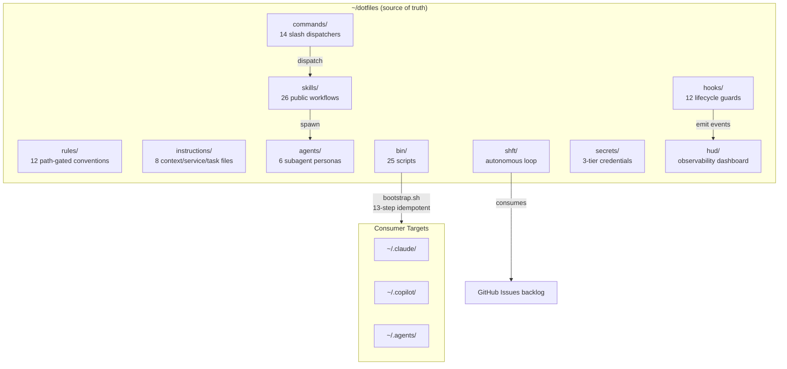

# Architecture

Internal system map for ctrl+shft. Start here, follow the links.

> **Public docs:** [README.md](../README.md) — installation, usage, roadmap.
> **This doc:** How the system works under the hood.

---

## System Diagram



---

## Subsystems

| Directory | Purpose | Details |
|-----------|---------|---------|
| [rules/](../rules/README.md) | Path-gated coding conventions (T3) | 12 files, load when edited file matches `paths` glob |
| [instructions/](../instructions/README.md) | Context, service, and task-triggered knowledge (T1–T2) | 8 files + `_local/`, tiered loading |
| [skills/](../skills/README.md) | Multi-step workflow definitions (T4) | 26 public skills, triggered by task description |
| [agents/](../agents/README.md) | Read-only subagent personas | 6 agents across 3 model tiers (Haiku/Sonnet/Opus) |
| [commands/](../commands/README.md) | `/slash` command dispatchers | 14 commands, each loads one skill |
| [hooks/](../hooks/README.md) | Claude Code lifecycle guards | Block secrets, migrations, auto-compaction; format on stop |
| [bin/](../bin/README.md) | CLI scripts and infrastructure | Bootstrap, context detection, HUD daemon, secret management |
| [shft/](../shft/README.md) | Autonomous execution loop | HITL and AFK modes, `srt`-sandboxed, issue-driven |
| [secrets/](../secrets/README.md) | Three-tier credential isolation | Config / credentials / AFK tokens — agents never see credentials |
| [hud/](../hud/README.md) | Real-time observability dashboard | HTTP + WebSocket daemon, SQLite persistence, scanline UI |
| [clients/](../clients/README.md) | Per-client project isolation | Auto-detected on `cd()`, injects client instructions |
| [docs/](../docs/) | ADRs, reference material, site source | Architecture decisions, audit findings, plans |

---

## Four-Tier Disclosure Model

Instructions load progressively — the always-on payload stays small, conditional knowledge loads only when needed.

| Tier | Loaded when | Location | Example |
|------|-------------|----------|---------|
| **T1** always-on | Every session | `global.instructions.md`, `instructions/handoff.instructions.md` | Session handoff protocol |
| **T2** context-gated | `ACTIVE_CONTEXTS` matches | `instructions/{nextjs,sanity,php}.instructions.md` | Next.js 16 breaking changes |
| **T2** service/task | Service active or task type | `instructions/{css,sentry,hud,google-docs}.instructions.md` | Sentry MCP integration |
| **T3** path-gated | Edited file matches glob | `rules/*.md` | TypeScript conventions on `*.ts` |
| **T4** skill-triggered | Task description matches | `skills/*/SKILL.md` | TDD workflow on "write tests first" |

See [ADR-002](adr/ADR-002-four-tier-disclosure.md) for the decision rationale.

---

## Propagation Flow

```
~/dotfiles/          ──bootstrap.sh──►  ~/.claude/     (symlinks; Windows: copies)
  CLAUDE.base.md     ──awk + append──►  CLAUDE.md      (generated, gitignored)
  rules/             ──symlink──────►   ~/.claude/rules/
  skills/            ──symlink──────►   ~/.claude/skills/  +  ~/.copilot/skills/  +  ~/.agents/skills/
  agents/            ──symlink──────►   ~/.claude/agents/
  commands/          ──symlink──────►   ~/.claude/commands/
  hooks/             ──symlink──────►   ~/.claude/hooks/   +  settings.json merge
  bin/ctrl           ──symlink──────►   ~/.local/bin/ctrl
  shft/shft          ──symlink──────►   ~/.local/bin/shft
```

Shell integration injects a managed block into `~/.bashrc`/`~/.zshrc` that runs `detect-context.sh` and `detect-client.sh` on every `cd()`.

---

## Pipeline

```
Commands (/work, /plan, /review...)     ← user-facing slash commands
    │  dispatch to
Skills (do-work, architect, code-review...)  ← full workflow definitions
    │  spawn as sub-agents
Agents (researcher, code-reviewer...)    ← read-only explorers
```

The planning pipeline chains skills end-to-end:

```
/grill-me → /write-a-prd → /architect → /prd-to-issues → /do-work → shft
```

---

## Where to Look

| I need to... | Go to |
|-------------|-------|
| Add a coding convention | [rules/](../rules/README.md) — create `rules/your-rule.md` with `paths` frontmatter |
| Add stack-specific knowledge | [instructions/](../instructions/README.md) — create or edit the matching `.instructions.md` |
| Create a new workflow | [skills/](../skills/README.md) — create `skills/your-skill/SKILL.md` |
| Add a slash command | [commands/](../commands/README.md) — create `commands/your-command.md` dispatching to a skill |
| Add a subagent persona | [agents/](../agents/README.md) — create `agents/your-agent.md` with model frontmatter |
| Add a lifecycle guard | [hooks/](../hooks/README.md) — create script + add entry to `settings-hooks.json` |
| Understand a past decision | [docs/adr/](adr/) — read the relevant ADR |
| Add private/client content | `skills/_local/`, `instructions/_local/`, [clients/](../clients/README.md) — all gitignored |
| Debug bootstrap | [bin/](../bin/README.md) — `validate-symlinks.sh`, `validate-env.sh` |

---

## ADRs

| ADR | Decision |
|-----|----------|
| [ADR-001](adr/ADR-001-vendor-boundary.md) | Vendor skills removed — `skills/` is universal workflow only |
| [ADR-002](adr/ADR-002-four-tier-disclosure.md) | Four-tier progressive disclosure model |
| [ADR-003](adr/ADR-003-hud-observability.md) | HUD observability architecture |
