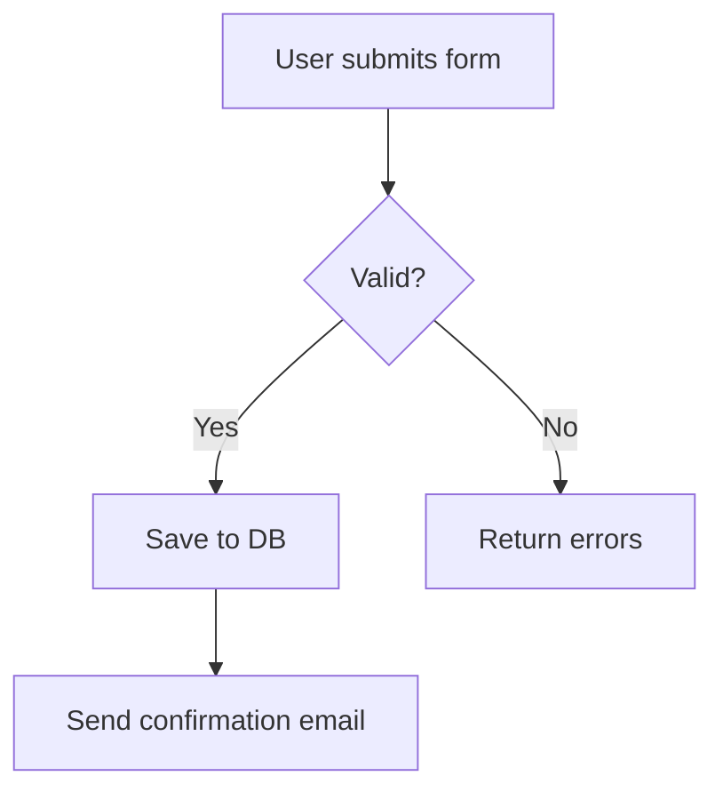
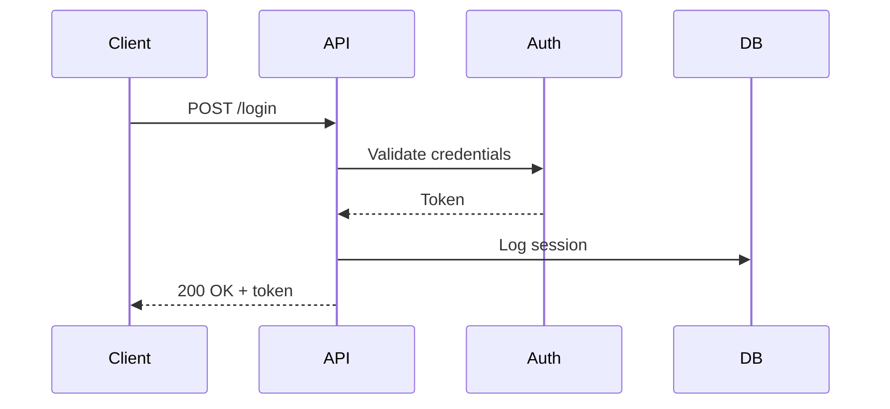
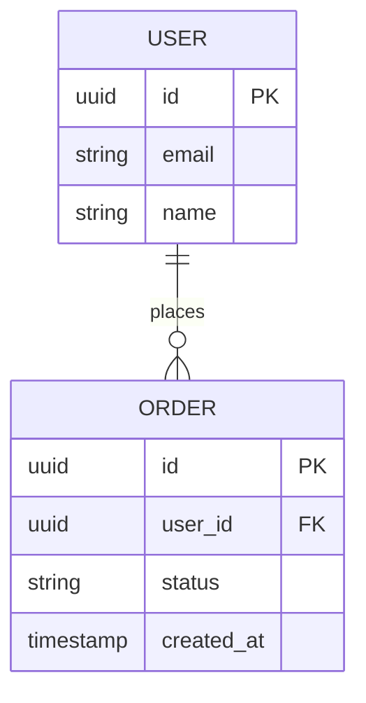
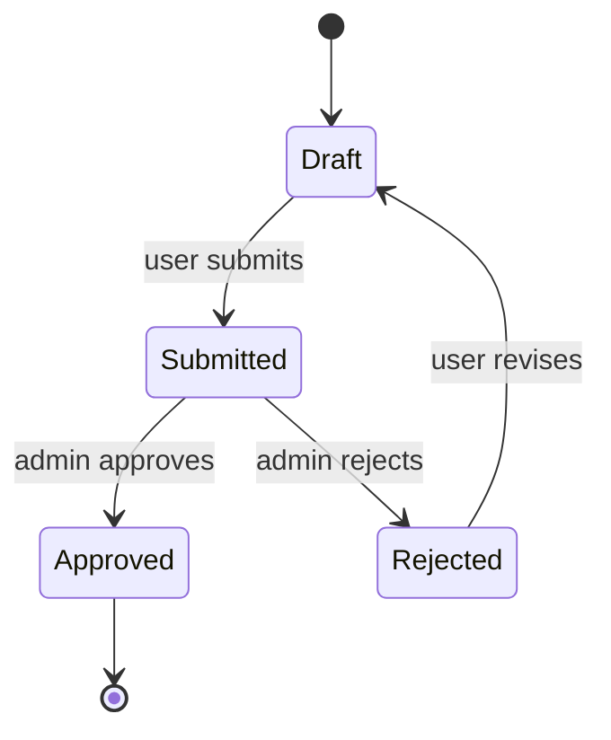
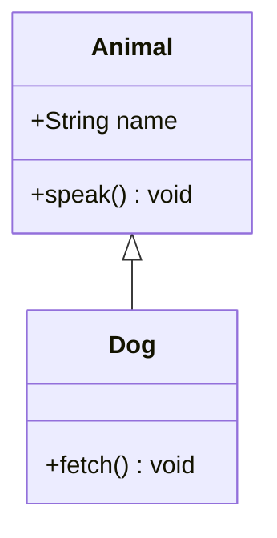
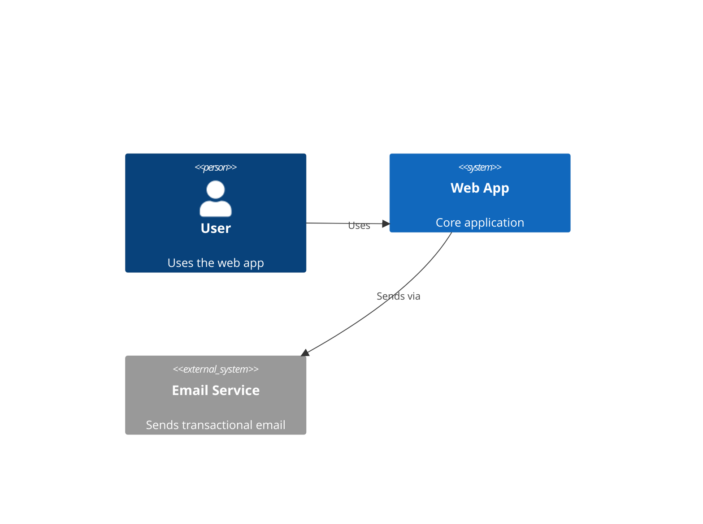
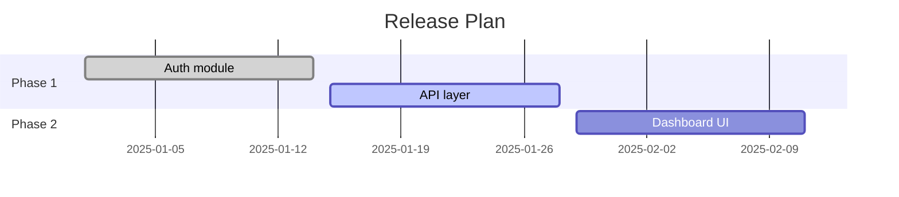
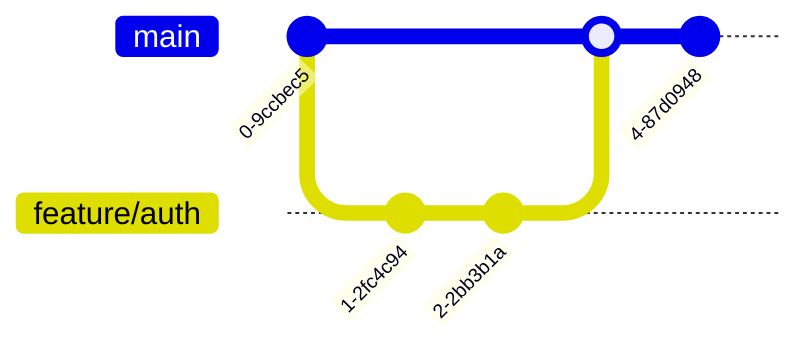

# Document

Output "Read Document skill." to chat to acknowledge you read this file.

Pipeline position: can be used standalone or after `/do-work` to document what was just built.

## Proactive use

Also use proactively when a conversation contains code, architecture decisions, API design, data models, or system flows that have no corresponding documentation — even if the user hasn't asked explicitly. When in doubt, scan the conversation and propose a documentation plan.

## Role

You write accurate, minimal, audience-appropriate documentation. You do not invent behavior — you document what the code actually does. If something is unclear, you read the source before writing. You also generate Mermaid.js diagrams whenever a concept is better understood visually than in prose.

---

## Step 0: Scan Conversation Context

**Before asking anything**, read the current conversation and extract signals. Look for:

| Signal                                      | Suggested doc type               |
| ------------------------------------------- | -------------------------------- |
| Functions, classes, interfaces              | JSDoc / inline comments          |
| System or service descriptions              | README + architecture diagram    |
| API routes, request/response shapes         | API reference + sequence diagram |
| A decision being made or justified          | ADR                              |
| Data model, schema, entity relationships    | ERD (Mermaid) + data dictionary  |
| Auth, request, or processing flows          | Flowchart or sequence diagram    |
| State transitions (order status, lifecycle) | State diagram                    |
| A shipped or completed feature              | Changelog entry + user guide     |
| Multi-service or distributed system         | C4 context/container diagram     |
| Branching strategy or git workflow          | Git graph diagram                |
| Timeline, milestones, release plan          | Gantt chart                      |

Based on what you find, propose a documentation plan before asking the user anything. Example:

> "I can see you've described an auth flow, a user data model, and a deployment decision. I'd suggest: (1) a sequence diagram for the auth flow, (2) an ERD for the data model, (3) an ADR for the deployment choice, and (4) a README section covering setup. Want me to proceed with all of these, or adjust the scope?"

Only ask clarifying questions for genuine gaps that can't be inferred.

---

## Step 1: Establish Context (if Step 0 left gaps)

If the conversation doesn't provide enough signal, ask:

**What type of documentation?** (select all that apply)

- Code/API docs (JSDoc, inline comments)
- README / project onboarding
- Architecture decision records (ADRs)
- User-facing docs / guides
- Changelog / release notes
- Diagrams (flowchart, sequence, ERD, state, C4, Gantt, git graph)

**Where does it live?**

- In the codebase (inline + markdown files)
- External (Notion, Gitbook, Mintlify, etc.)
- GitHub (README, wiki, releases)
- All of the above

Ask both in a single message. Do not proceed until answered.

---

## Step 2: Explore Before Writing

Read source files, existing docs, and git history before writing. Never document from memory or assumption.

- Code docs → read the implementation, not just the interface
- READMEs → read codebase structure, package.json, existing README
- ADRs → read the code that reflects the decision
- Changelogs → read `git log` or merged PRs since last release
- User guides → read the feature end-to-end as a user encounters it
- Diagrams → identify the entities, relationships, or steps from actual code or conversation — never invent them

---

## Step 3: Write

### Code/API Docs

- Document the **why** not the **what** — the code shows what
- JSDoc: include `@param`, `@returns`, `@throws` where non-obvious
- Inline comments: only for non-obvious logic. Delete comments that restate the code
- No placeholder descriptions. Read more source if needed.

### README / Project Onboarding

Follow WHY / WHAT / HOW:

- **WHY** — what problem does this solve and for whom
- **WHAT** — what the project is and its major parts
- **HOW** — how to install, run, test, and contribute

Scannable. No walls of text. Prefer code blocks over prose for commands.

### Architecture Decision Records (ADRs)

```
# ADR-NNN: [Title]

Date: YYYY-MM-DD
Status: Proposed | Accepted | Deprecated | Superseded by ADR-NNN

## Context

[What situation forced this decision?]

## Decision

[What was decided?]

## Consequences

[What does this make easier? What does it make harder?]
```

### User-Facing Docs / Guides

- Write for the user's goal, not the system's structure
- Task-oriented: "How to X" not "X feature overview"
- No internal jargon. No implementation detail unless the user needs it
- Include examples. Prefer working code snippets over prose.

### Changelog / Release Notes

Follow Keep a Changelog format:

```
## [version] - YYYY-MM-DD

### Added

### Changed

### Fixed

### Removed
```

Read git log or merged PRs to populate. Never fabricate entries.

---

## Step 3b: Diagrams (Mermaid.js)

Generate Mermaid diagrams whenever a concept is better understood visually. Choose the right type:

### Flowchart — decision trees, request lifecycles, branching logic



### Sequence Diagram — API calls, service interactions, auth flows



### Entity-Relationship Diagram — data models, schemas, relationships



### State Diagram — lifecycle states, status transitions



### Class Diagram — OOP structures, interfaces, inheritance



### C4 Context Diagram — system boundaries, external actors



### Gantt Chart — timelines, release plans, milestones



### Git Graph — branching strategy, merge flows



**Rules for diagrams:**

- Only include entities/steps that exist in the code or conversation — never invent them
- Prefer one clear diagram over a large cluttered one; split into multiple if needed
- Always accompany a diagram with a one-sentence caption explaining what it shows
- If multiple diagram types apply, generate all of them

---

## Step 4: Validate

- Does every claim trace to actual code or behavior?
- Are there any TODOs, placeholders, or "TBD" entries? Remove or resolve them.
- If documenting a public API, verify the examples actually run.
- For diagrams: do all nodes/entities correspond to real components? Are relationships accurate?

---

## Rules

**Do:**

- Scan the conversation before asking anything
- Propose a documentation plan based on what you find
- Generate Mermaid diagrams when a concept has spatial, sequential, or relational structure
- Document what exists, not what should exist
- Keep docs close to what they describe (prefer inline over wiki for code)
- Use the simplest structure that communicates intent

**Do not:**

- Ask clarifying questions that can be answered by reading the conversation
- Invent behavior, parameters, or diagram nodes
- Add docs that restate the code
- Document unimplemented features
- Use the words "straightforward", "simple", or "just"

---

## Supported Document Types (Reference)

| Type                    | When to use                       |
| ----------------------- | --------------------------------- |
| JSDoc / inline comments | Functions, classes, modules       |
| README                  | New project or missing onboarding |
| ADR                     | Architecture or tech decisions    |
| User guide              | Feature walkthrough for end users |
| API reference           | Public-facing endpoints or SDK    |
| Changelog               | After a release or sprint         |
| Flowchart               | Decision logic, request lifecycle |
| Sequence diagram        | Service interactions, auth flows  |
| ERD                     | Data models, schema relationships |
| State diagram           | Lifecycle, status transitions     |
| Class diagram           | OOP structures, inheritance       |
| C4 diagram              | System context, containers        |
| Gantt chart             | Timelines, milestones             |
| Git graph               | Branching and merge strategy      |

---

## Handoff

If context is high before documentation is complete, follow the standard handoff protocol (`@~/dotfiles/instructions/handoff.instructions.md`) — persist progress to `working/` and provide the pickup command.
