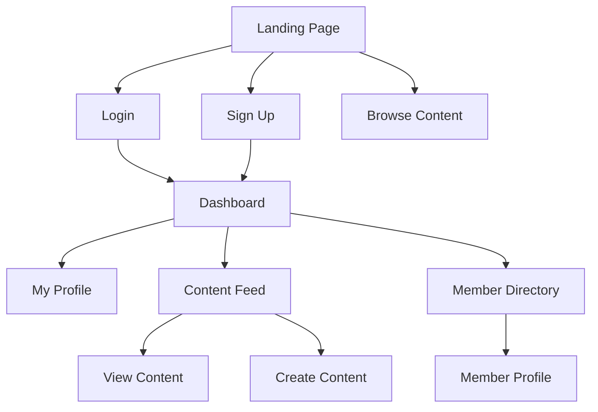

# UX Step 3.2 — Create Flow Diagram

Output "Read UX Create Flow Diagram skill." to chat to acknowledge you read this file.

Phase: `/ux-flow-diagram` → Step 2 of 3

Turn the screen inventory into a navigation flow. Map which screen leads to which, based on user actions and user type.

## Process

1. **Start from the landing page** and map outward:
   - Landing → Sign Up / Login
   - Login → Dashboard / Main View
   - Dashboard → Browse / Create / Profile / Settings

2. **Annotate paths by user type:**
   - Paths available to all users: unmarked
   - Paths specific to user type A: labeled `[A]`
   - Paths specific to user type B: labeled `[B]`

3. **Apply the Instant Gratification principle:**
   - Let users see value BEFORE asking for login/signup
   - Show the product before requesting credentials

4. **Generate Mermaid flowchart:**

5. **Include navigation back-paths** — not just forward flow (e.g., Sign Out → Landing, Back to Dashboard)

## Rules

- Every screen must be reachable from at least one other screen
- Every screen must have at least one exit path
- Mark user-type-specific paths clearly
- Show value before asking for credentials (Instant Gratification)
- Design the IDEAL flow first — cut to MVP later

## Output

Append to `flow-diagram.md`: Mermaid flowchart with user-type annotations.
