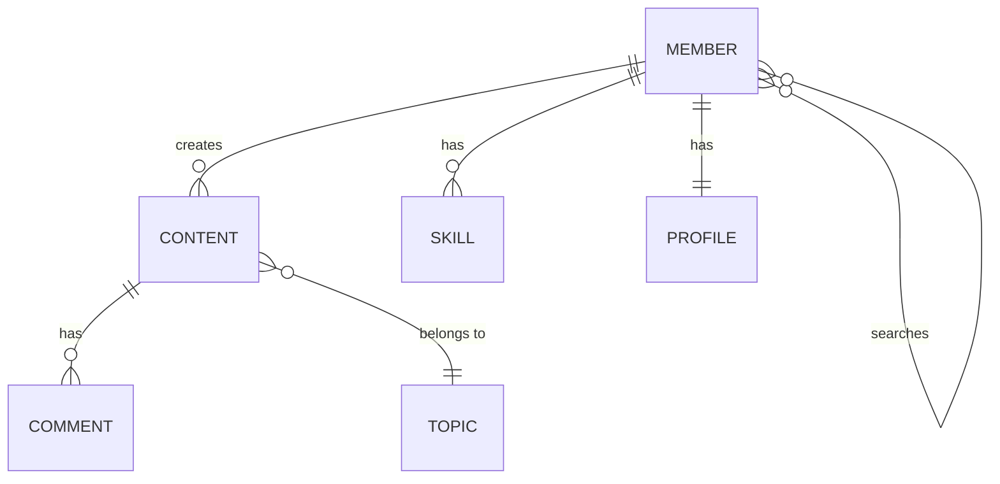

# UX Step 2.2 — Draw Relationships

Output "Read UX Draw Relationships skill." to chat to acknowledge you read this file.

Phase: `/ux-system-map` → Step 2 of 2

Connect entities with labeled relationships showing how they interact. Generate a Mermaid entity-relationship diagram.

## Process

1. **Take the entity inventory** from Step 2.1

2. **Map relationships between entities** using the verbs extracted in Phase 1:
   - Member **creates** Content
   - Member **has** Skills, Status, Project, Location
   - Member **searches** Members (by skills, location)
   - Content **has** Topic, Type, Comments, Links, Images

3. **Generate Mermaid ERD:**

4. **Label every arrow** with the action verb (creates, views, edits, searches, has)

5. **Validate completeness** — trace each user story through the diagram:
   - Can you follow the path of every story?
   - Are there entities mentioned in stories but missing from the map?
   - Are there relationships implied but not drawn?

## Rules

- Every entity must connect to at least one other entity
- Every relationship must have a labeled action verb
- Use standard ERD cardinality notation (one-to-one, one-to-many, many-to-many)
- Cross-reference against ALL user stories for completeness

## Output

Append to `system-map.md`: Mermaid ERD diagram and relationship table.
